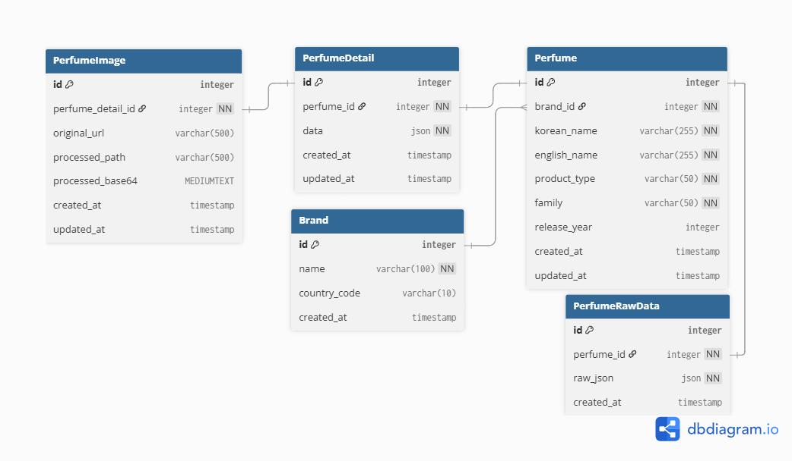

<div align="center">

# 🌸 Olfít

### 나만의 시각적 아우라와 향기 취향을 연결하여 최적의 향수를 제안하는

**AI 기반 개인화 향수 추천 서비스**

사용자가 업로드한 OOTD 이미지를 AI로 분석하고, <br/>사용자의 명시적 성분 취향을 결합하여 개인화된 '향기 아우라'를 도출합니다. <br/>800여 개의 실제 향수 데이터를 기반으로 한 벡터 매칭 알고리즘을 통해 감성과 데이터의 완벽한 연결을 제공합니다.

<br/>

[🚀 설치 & 실행](#-설치--실행) · [🧠 주요 기능](#-주요-기능) · [🏗️ 아키텍처](#️-아키텍처)

</div>

---

## 👥 팀원

> **조라에몽의 만능 도구들** 팀 — SK Networks 26기 4차 프로젝트

<table>
  <tr>
    <td align="center">
      <br />
      <b>이창우</b><br />
      <a href="https://github.com/Gloveman">@Gloveman</a>
    </td>
    <td align="center">
      <br />
      <b>장한재</b><br />
      <a href="https://github.com/rusidian">@rusidian</a>
    </td>
    <td align="center">
      <br />
      <b>전승권</b><br />
      <a href="https://github.com/eaent">@eaent</a>
    </td>
    <td align="center">
      <br />
      <b>전종혁</b><br />
      <a href="https://github.com/jjonyeok2">@jjonyeok2</a>
    </td>
    <td align="center">
      <br />
      <b>조동휘</b><br />
      <a href="https://github.com/nobrain711">@nobrain711</a>
    </td>
    <td align="center">
      <br />
      <b>최수아</b><br />
      <a href="https://github.com/sooa02">@sooa02</a>
    </td>
    <td align="center">
      <br />
      <b>홍완기</b><br />
      <a href="https://github.com/dhksrlghd">@dhksrlghd</a>
    </td>
  </tr>
</table>

---

## ✨ 주요 기능

<table style="width:100%; table-layout:fixed; border-collapse:collapse;">
  <colgroup>
    <col style="width:30%;">
    <col style="width:70%;">
  </colgroup>
  <thead>
    <tr>
      <th style="padding:8px; text-align:left;">기능</th>
      <th style="padding:8px; text-align:left;">설명</th>
    </tr>
  </thead>
  <tbody>
    <tr>
      <td style="padding:8px;">🖼️ <b>AI 이미지 분석</b></td>
      <td style="padding:8px;">OOTD 이미지에서 색상, 감성을 추출하여 5축 아우라 스코어 산출 (Floral / Woody / Amber / Fresh / Gourmand)</td>
    </tr>
    <tr>
      <td style="padding:8px;">🎯 <b>향수 매칭</b></td>
      <td style="padding:8px;">이미지 감성과 사용자의 명시적 성분 취향을 결합한 다차원 벡터 매칭으로 최적 향수 추천</td>
    </tr>
    <tr>
      <td style="padding:8px;">📊 <b>인사이트 리포트</b></td>
      <td style="padding:8px;">분석 결과를 레이더 차트와 함께 고해상도 이미지 리포트로 캡처 및 공유</td>
    </tr>
    <tr>
      <td style="padding:8px;">🛡️ <b>개인정보 동의 흐름</b></td>
      <td style="padding:8px;">서비스 이용 전 개인정보 수집 동의 프로세스 및 익명 세션 기반 분석</td>
    </tr>
  </tbody>
</table>

### 기술 특징
- **AI Emotional Mapping**: 이미지에서 색상, 감성을 추출하여 5축 아우라 스코어 산출
- **Symmetric Scent Search**: 한글화된 대칭형 쿼리로 이미지 감성과 향수 노트를 직관적으로 매칭
- **High-Resolution Insights**: 레이더 차트와 함께 고해상도 이미지 리포트로 캡처 및 공유
- **Hybrid Storage Strategy**: 관계형 메타데이터와 JSON 상세 정보를 결합한 하이브리드 아키텍처

---

## 🛠️ 기술 스택

### Language & Framework

| 분류 | 기술 | 버전 | 용도 |
|---|---|---|---|
| Language |  | 3.12 | 백엔드 전체 |
| Language |  | 5.9 | 프론트엔드 컴포넌트 및 클라이언트 로직 |
| Frontend |  | 19.2.0 | UI 컴포넌트 구성 |
| Build Tool |  | 7.x | 개발 서버 및 번들링 |
| Backend |  | 6.0.5 | REST API 서버 |
| Backend |  | 3.17.1 | REST API 구현 |

### Database

| 분류 | 기술 | 용도 |
|---|---|---|
| RDBMS |  | 향수 메타데이터, 사용자 정보 |
| JSON Column |  models.JSONField | 향수 상세 정보, 노트, 아우라 프로필 등 반정형 데이터 |

### AI / ML

| 분류 | 모델 / 라이브러리 | 용도 |
|---|---|---|
| VLM | **NVIDIA NIM (google/gemma-3n-e4b-it)** | 이미지 감성 분석 및 아우라 스코어 산출 |
| 유사도 | NumPy + scikit-learn | 아우라 벡터 연산 및 코사인 유사도 기반 추천 점수 계산 |

### Frontend 라이브러리

| 기술 | 버전 | 용도 |
|---|---|---|
| Zustand | 5.0.13 | 전역 상태 관리 |
| Axios | 1.16.0 | API 통신 |
| Recharts | 2.15.4 | 레이더 차트 등 데이터 시각화 |
| html2canvas | 1.4.1 | 분석 리포트 이미지 캡처 |
| Tailwind CSS | 3.4.19 | 유틸리티 기반 스타일링 |
| Radix UI | `@radix-ui/react-*` | 접근성 기반 headless UI 컴포넌트 |
| Lucide React | 0.562.0 | 아이콘 |
| Embla Carousel | 8.6.0 | 캐러셀 UI |

### Infrastructure

| 기술 | 용도 |
|---|---|
|  | 컨테이너 환경 구성 |
|  | 프론트엔드 · 백엔드 · DB 멀티 컨테이너 오케스트레이션 |

### Co-Tools

| 기술 | 용도 |
|---|---|
|  | 애자일 프로젝트 스프린트 설정 및 관리 |
|  | 업무 및 프로젝트 관리 |
|  | 업무 메신저 |

---

## 🏗️ 아키텍처

### 시스템 흐름도 (이미지 추가)

### 파이프라인 (이미지 추가)

### 데이터베이스 설계 (ERD)

<div align="center">
  
</div>

---

## 📁 프로젝트 구조 (최종 리팩토링 후 세부 폴더 추가)

```
olfit/
├── .github/
├── backend/
├── database/
├── docs/
├── frontend/
├── models/
├── wiki/
├── .env.example
├── .gitignore
├── LICENSE
├── README.md
└── docker-compose.yml
```

---

## 🖥️ 서비스 화면 (이미지 추가)

---

## 🚀 설치 & 실행

### 사전 요구사항

- **Docker & Docker Compose**: 컨테이너 환경 실행을 위해 필수입니다.
- **Git**: 레포지토리 클론 및 소스 관리를 위해 필요합니다.
- **NVIDIA API Key**: NVIDIA NIM VLM 이미지 분석 API 접근을 위해 필요합니다.

### 방법: Clone하여 실행을 권장

```bash
# 1. 레포지토리 클론
git clone https://github.com/Joraemon-s-Secret-Gadgets/olfit.git
cd olfit

# 2. 환경 변수 설정
cp .env.example .env
# .env 파일을 열어 필요한 값을 입력 (아래 환경 변수 섹션 참고)

# 3. Docker Compose로 전체 서비스 실행
docker compose up -d --build

# 4. 서비스 접속
# Frontend Web : http://localhost:3000
# Backend API  : http://localhost:8000
# Database     : localhost:3307 (External Access)
```

### 환경 변수 설정 (`.env`)

```env
# NVIDIA NIM
NVIDIA_API_KEY=your_nvidia_api_key_here

# Database
SQL_DB_PASSWORD=your_db_password
```

### 서비스 상태 확인

```bash
# 전체 컨테이너 상태 확인
docker compose ps

# 로그 확인
docker compose logs -f

# 특정 서비스 로그만 확인
docker compose logs -f backend
docker compose logs -f frontend
```

### 서비스 종료

```bash
# 컨테이너 종료
docker compose down

# 컨테이너 + 볼륨 삭제 (DB 데이터 포함)
docker compose down -v
```

---

## 📖 사용 가이드

### 1. 개인정보 동의

서비스 접속 시 AI 분석을 위한 개인정보 수집 동의 절차를 진행합니다. 동의 후 익명 세션 ID가 발급됩니다.

### 2. 향기 노트 선택

선호하는 향기 노트(베르가못, 장미, 샌달우드 등)를 직접 선택합니다. 이미지 분석 결과와 결합하여 최종 추천에 반영됩니다.

### 3. 이미지 업로드 & AI 분석

OOTD 이미지를 업로드합니다. NVIDIA NIM(Gemma VLM)이 이미지를 분석하여 5축 아우라 스코어를 산출합니다.

| 축 | 설명 |
|---|---|
| 🌸 Floral | 꽃향기 계열 감성 |
| 🌲 Woody | 우드·어스 계열 감성 |
| 🍂 Amber | 오리엔탈·앰버 계열 감성 |
| 🍃 Fresh | 시트러스·아쿠아 계열 감성 |
| 🍫 Gourmand | 달콤·구르망 계열 감성 |

### 4. 인사이트 리포트 확인

분석 결과를 레이더 차트와 함께 확인하고, 추천 향수 리스트를 탐색합니다. 리포트는 이미지로 캡처하여 공유할 수 있습니다.

---

## 한계 (작성 필요)

---

## 확장 방향 (작성 필요)

---

## 🔍 사전 조사 레포지토리 (이후 링크 추가)

본 프로젝트를 위해 팀원들이 각자 진행한 사전 기술 조사 및 프로토타입 레포지토리입니다.

---

## 📌 버전 히스토리 (업데이트 필요)

| 버전 | 설명 | 상태 |
|---|---|---|
| `v0.1.0` | Docker Compose 기반 전체 서비스 스택 구축 |  |
| `v0.2.0` | BE · FE · AI 통합 |  |
| `v0.3.0` | 버그 수정 및 안정화 |  |
| `v0.4.0` | 코드 리팩토링 및 성능 개선 |  |
| `v0.5.0` | 배포 및 발표 준비 |  |

---

## 🔗 관련 문서 (추가 필요)

---

## 프로젝트 회고

### 개인 회고

<table style="width: 100%; border-collapse: collapse; border: 1px solid #ddd;">
    <thead>
        <tr style="background-color: #f8f9fa;">
            <th style="width: 20%; border: 1px solid #ddd; padding: 10px;">이름</th>
            <th style="border: 1px solid #ddd; padding: 10px;">회고</th>
        </tr>
    </thead>
    <tbody>
        <tr>
            <td style="text-align: center; border: 1px solid #ddd; padding: 10px;">이창우</td>
            <td style="border: 1px solid #ddd; padding: 10px;"></td>
        </tr>
        <tr>
            <td style="text-align: center; border: 1px solid #ddd; padding: 10px;">장한재</td>
            <td style="border: 1px solid #ddd; padding: 10px;"></td>
        </tr>
            <tr>
            <td style="text-align: center; border: 1px solid #ddd; padding: 10px;">전승권</td>
            <td style="border: 1px solid #ddd; padding: 10px;"></td>
        </tr>
        <tr>
            <td style="text-align: center; border: 1px solid #ddd; padding: 10px;">전종혁</td>
            <td style="border: 1px solid #ddd; padding: 10px;"></td>
        </tr>
        <tr>
            <td style="text-align: center; border: 1px solid #ddd; padding: 10px;">조동휘</td>
            <td style="border: 1px solid #ddd; padding: 10px;"></td>
        </tr>
        <tr>
            <td style="text-align: center; border: 1px solid #ddd; padding: 10px;">최수아</td>
            <td style="border: 1px solid #ddd; padding: 10px;"></td>
        </tr>
    </tbody>
</table>

---

### 팀원 회고

<table style="width: 100%; border-collapse: collapse; border: 1px solid #ddd; margin-bottom: 30px;">
    <thead>
        <tr style="background-color: #f8f9fa;">
            <th style="width: 15%; border: 1px solid #ddd; padding: 10px;">대상자</th>
            <th style="width: 15%; border: 1px solid #ddd; padding: 10px;">작성자</th>
            <th style="border: 1px solid #ddd; padding: 10px;">회고 내용</th>
        </tr>
    </thead>
    <tbody>
        <tr>
            <td rowspan="5" style="text-align: center; font-weight: bold; border: 1px solid #ddd; padding: 10px;">이창우</td>
            <td style="text-align: center; border: 1px solid #ddd; padding: 10px;">장한재</td>
            <td style="border: 1px solid #ddd; padding: 10px;"></td>
        </tr>
        <tr>
            <td style="text-align: center; border: 1px solid #ddd; padding: 10px;">전승권</td>
            <td style="border: 1px solid #ddd; padding: 10px;"></td>
        </tr>
        <tr>
            <td style="text-align: center; border: 1px solid #ddd; padding: 10px;">전종혁</td>
            <td style="border: 1px solid #ddd; padding: 10px;"></td>
        </tr>
        <tr>
            <td style="text-align: center; border: 1px solid #ddd; padding: 10px;">조동휘</td>
            <td style="border: 1px solid #ddd; padding: 10px;"></td>
        </tr>
        <tr>
            <td style="text-align: center; border: 1px solid #ddd; padding: 10px;">최수아</td>
            <td style="border: 1px solid #ddd; padding: 10px;"></td>
        </tr>
        <tr>
            <td rowspan="5" style="text-align: center; font-weight: bold; border: 1px solid #ddd; padding: 10px;">장한재</td>
            <td style="text-align: center; border: 1px solid #ddd; padding: 10px;">이창우</td>
            <td style="border: 1px solid #ddd; padding: 10px;"></td>
        </tr>
        <tr>
            <td style="text-align: center; border: 1px solid #ddd; padding: 10px;">전승권</td>
            <td style="border: 1px solid #ddd; padding: 10px;"></td>
        </tr>
        <tr>
            <td style="text-align: center; border: 1px solid #ddd; padding: 10px;">전종혁</td>
            <td style="border: 1px solid #ddd; padding: 10px;"></td>
        </tr>
        <tr>
            <td style="text-align: center; border: 1px solid #ddd; padding: 10px;">조동휘</td>
            <td style="border: 1px solid #ddd; padding: 10px;"></td>
        </tr>
        <tr>
            <td style="text-align: center; border: 1px solid #ddd; padding: 10px;">최수아</td>
            <td style="border: 1px solid #ddd; padding: 10px;"></td>
        </tr>
        <tr>
            <td rowspan="5" style="text-align: center; font-weight: bold; border: 1px solid #ddd; padding: 10px;">전승권</td></td>
            <td style="text-align: center; border: 1px solid #ddd; padding: 10px;">이창우</td>
            <td style="border: 1px solid #ddd; padding: 10px;"></td>
        </tr>
        <tr>
            <td style="text-align: center; border: 1px solid #ddd; padding: 10px;">장한재</td>
            <td style="border: 1px solid #ddd; padding: 10px;"></td>
        </tr>
        <tr>
            <td style="text-align: center; border: 1px solid #ddd; padding: 10px;">전종혁</td>
            <td style="border: 1px solid #ddd; padding: 10px;"></td>
        </tr>
        <tr>
            <td style="text-align: center; border: 1px solid #ddd; padding: 10px;">조동휘</td>
            <td style="border: 1px solid #ddd; padding: 10px;"></td>
        </tr>
        <tr>
            <td style="text-align: center; border: 1px solid #ddd; padding: 10px;">최수아</td>
            <td style="border: 1px solid #ddd; padding: 10px;"></td>
        </tr>
        <tr>
            <td rowspan="5" style="text-align: center; font-weight: bold; border: 1px solid #ddd; padding: 10px;">전종혁</td>
            <td style="text-align: center; border: 1px solid #ddd; padding: 10px;">이창우</td>
            <td style="border: 1px solid #ddd; padding: 10px;"></td>
        </tr>
        <tr>
            <td style="text-align: center; border: 1px solid #ddd; padding: 10px;">장한재</td>
            <td style="border: 1px solid #ddd; padding: 10px;"></td>
        </tr>
        <tr>
            <td style="text-align: center; border: 1px solid #ddd; padding: 10px;">전승권</td>
            <td style="border: 1px solid #ddd; padding: 10px;"></td>
        </tr>
        <tr>
            <td style="text-align: center; border: 1px solid #ddd; padding: 10px;">조동휘</td>
            <td style="border: 1px solid #ddd; padding: 10px;"></td>
        </tr>
        <tr>
            <td style="text-align: center; border: 1px solid #ddd; padding: 10px;">최수아</td>
            <td style="border: 1px solid #ddd; padding: 10px;"></td>
        </tr>
        <tr>
            <td rowspan="5" style="text-align: center; font-weight: bold; border: 1px solid #ddd; padding: 10px;">조동휘</td>
            <td style="text-align: center; border: 1px solid #ddd; padding: 10px;">이창우</td>
            <td style="border: 1px solid #ddd; padding: 10px;"></td>
        </tr>
        <tr>
            <td style="text-align: center; border: 1px solid #ddd; padding: 10px;">장한재</td>
            <td style="border: 1px solid #ddd; padding: 10px;"></td>
        </tr>
        <tr>
            <td style="text-align: center; border: 1px solid #ddd; padding: 10px;">전승권</td>
            <td style="border: 1px solid #ddd; padding: 10px;"></td>
        </tr>
        <tr>
            <td style="text-align: center; border: 1px solid #ddd; padding: 10px;">전종혁</td>
            <td style="border: 1px solid #ddd; padding: 10px;"></td>
        </tr>
        <tr>
            <td style="text-align: center; border: 1px solid #ddd; padding: 10px;">최수아</td>
            <td style="border: 1px solid #ddd; padding: 10px;"></td>
        </tr>
        <tr>
            <td rowspan="5" style="text-align: center; font-weight: bold; border: 1px solid #ddd; padding: 10px;">최수아</td>
            <td style="text-align: center; border: 1px solid #ddd; padding: 10px;">이창우</td>
            <td style="border: 1px solid #ddd; padding: 10px;"></td>
        </tr>
        <tr>
            <td style="text-align: center; border: 1px solid #ddd; padding: 10px;">장한재</td>
            <td style="border: 1px solid #ddd; padding: 10px;"></td>
        </tr>
        <tr>
            <td style="text-align: center; border: 1px solid #ddd; padding: 10px;">전승권</td>
            <td style="border: 1px solid #ddd; padding: 10px;"></td>
        </tr>
        <tr>
            <td style="text-align: center; border: 1px solid #ddd; padding: 10px;">전종혁</td>
            <td style="border: 1px solid #ddd; padding: 10px;"></td>
        </tr>
        <tr>
            <td style="text-align: center; border: 1px solid #ddd; padding: 10px;">조동휘</td>
            <td style="border: 1px solid #ddd; padding: 10px;"></td>
        </tr>
    </tbody>
</table>

---

## 📜 License

본 프로젝트는 **MIT License**를 따릅니다.<br/>
모든 소스 코드 및 관련 문서의 사용 및 배포 규정은 [LICENSE](./LICENSE) 파일에서 확인하실 수 있습니다.

<div align="center">
Copyright (c) 2026 SK Networks 26th 조라에몽의 만능 도구들 팀 (Team Joraemon-s-Secret-Gadgets)
</div>
